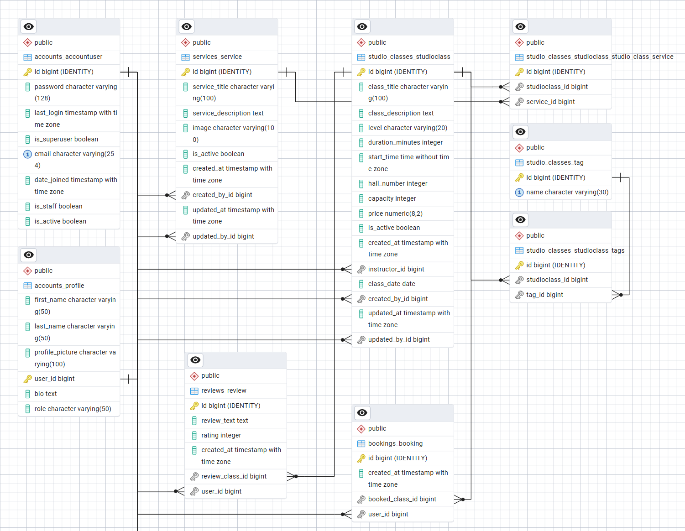

**The project is accessible at**: https://wellness-studio-g6c4auape4eje7bz.switzerlandnorth-01.azurewebsites.net/

Some emails and passwords, available during assessment:
- **Admin** – admin@studio.bg // admin@#123
- **Host** – val@abv.bg // val@#123
- **Instructor** – instructor@abv.bg // insta@#123 ; petya@abv.bg // petya@#123
- **Participant** – bali@abv.bg // bali@#123
---

# 🧘 Wellness Studio Platform

A Django-based web application for managing wellness studio activities, including class scheduling, bookings, reviews, and user roles.

---

## 📌 Project Overview

**Wellness Studio Platform** is a full-stack web application built with Django that allows users to explore, book, and manage wellness classes such as yoga, meditation, and fitness sessions.

---

## 🚀 Features

### 👤 User Management

* User registration and authentication
* Profile management with personal information and avatar
* Role-based access control throughout the application

The application supports multiple user roles with different permissions:

- **Admin** – full access to the system via Django admin panel
- **Host** – can create, edit, delete services (practices) and classes via manage platform
- **Instructor** – can edit classes related to him
- **Participant** – can browse classes, make bookings, and leave reviews

### 🧾 Services & Classes

* Browse available services (e.g. Yoga, Meditation)
* View all classes by service
* Detailed class pages with:

  * Description
  * Instructor
  * Level
  * Duration

### 📅 Booking System

* Book a class
* Cancel booking
* View personal bookings
* Prevent duplicate bookings

### ⭐ Reviews

* Users can leave reviews for classes
* Display average rating
* Paginated review list

### 🔐 Permissions & Security

* Login required for booking and reviewing
* Role-based restrictions for creating/editing classes
* CSRF protection and secure form handling

### ⚙️ Asynchronous Tasks

* Booking confirmation emails sent asynchronously using Celery

### 🔌 REST API

* API endpoints for:
  * Services
  * Classes
---

## 🏗️ Project Structure

The application is organized into multiple Django apps:

* `accounts` – user profiles and authentication
* `services` – service categories 
* `studio_classes` – studio classes and tags
* `bookings` – booking logic
* `reviews` – user reviews
* `core` – view manage page

---

## 🗄️ Database Design

* Relational database (PostgreSQL recommended)
* Includes:
  * One-to-One relationships (e.g. Profile → User)
  * Many-to-One relationships (e.g. Class → Service; CLass → User; Review → User; Review → Class; Booking → User; Booking → Class)
  * Many-to-Many relationships (e.g. Services ↔ Class; Class ↔ Tags)
  

---

## 🧪 Testing

The project includes unit tests for:

* Views
* Models
* Custom logic
* User-related functionality

---

## 🎨 Frontend

* Built using Django Templates
* Custom CSS (no external frameworks)
* Responsive design

---

## ⚙️ Installation

1. Clone the repository:

```bash
git clone <repo-url>
cd wellness-studio
```

2. Create a virtual environment:

```bash
python -m venv venv
source venv/bin/activate   # Linux / Mac
venv\Scripts\activate      # Windows
```

3. Install dependencies:

```bash
pip install -r requirements.txt
```

4. Create `.env` file:

```env
SECRET_KEY=your-secret-key
DEBUG=True
DATABASE_URL=your-database-url
```

5. Apply migrations:

```bash
python manage.py migrate
```

6. Run the server:

```bash
python manage.py runserver
```

---

## 🐳 Asynchronous Tasks Setup (Celery)

Make sure Redis is running, then start Celery:

```bash
celery -A project_name worker -l info
```

---

## 🌐 Deployment

The project is deployed and accessible at:

👉 **[Live Demo Link Here](https://wellness-studio-g6c4auape4eje7bz.switzerlandnorth-01.azurewebsites.net/)**

---

## 🔐 Environment Variables

Sensitive data is stored in environment variables:

* `SECRET_KEY`
* `DATABASE_URL`

---

## ❗ Additional Notes

* Custom error pages (404, 500) are implemented
* All pages are accessible via navigation
* No orphan pages
* Forms include validation and user-friendly error messages

---

## 👩‍💻 Author

Valentina Stefanova
@St_Valentina

---
